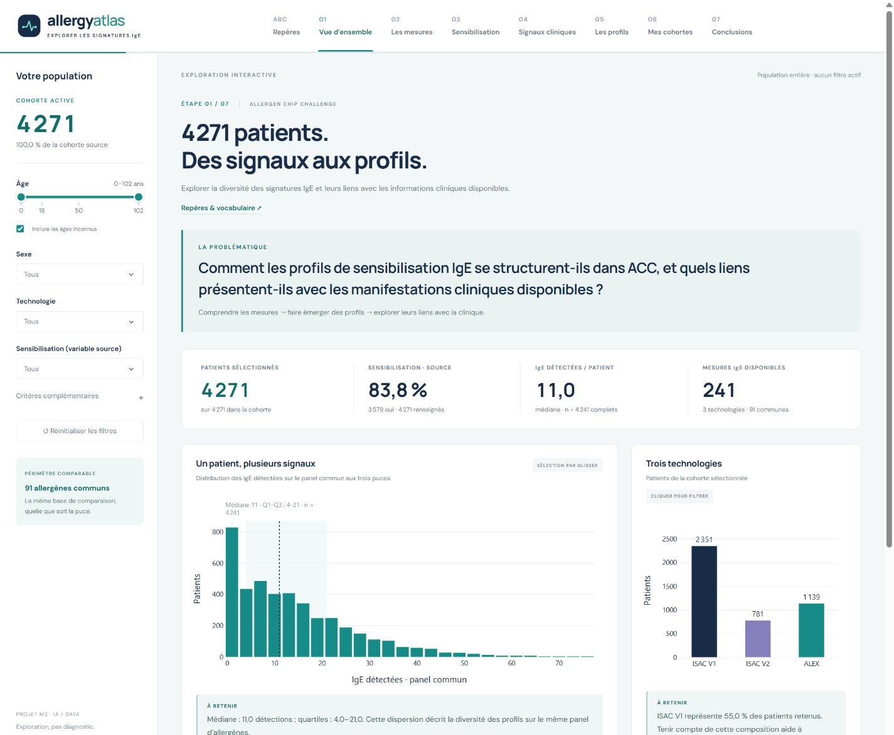

# Allergy Atlas

**Explorer les signatures IgE du Allergen Chip Challenge**  
Projet M2 IA / Data · Dashboard interactif en Python

> **Problématique :** comment les profils de sensibilisation IgE se structurent-ils dans ACC, et quels liens présentent-ils avec les manifestations cliniques disponibles ?

L’application transforme un fichier de **4 271 patients et 241 mesures IgE** en un parcours d’exploration : comprendre les technologies de mesure, comparer les signaux, observer les différences cliniques et construire ses propres cohortes. Les regroupements sont exploratoires ; ils ne constituent pas des diagnostics.

[Installation](#installation-et-lancement) · [Technologies](#technologies-utilisées) · [Parcours](#parcours-du-dashboard) · [Organisation](#organisation-du-projet) · [Présentation détaillée](docs/presentation.md)



## Ce que permet le dashboard

- Filtrer une population par âge, sexe, technologie, sensibilisation et informations cliniques disponibles.
- Cliquer sur certains graphiques pour affiner la sélection, ou sélectionner des patients sur la projection PCA.
- Lire un court **« À retenir » sous chaque graphique**, adapté à la sélection lorsqu’il présente un résultat chiffré.
- Explorer les regroupements IgE et observer leur composition clinique et technologique.
- Enregistrer deux cohortes A/B, comparer leurs signatures et exporter la sélection en CSV.
- Consulter **26 notions dans Repères & vocabulaire**, avec une recherche qui accepte les mots sans accents.
- Naviguer entre chapitres avec un fondu et un léger glissement directionnel. Ces effets respectent la préférence de réduction des animations.

## Technologies utilisées

Les versions des bibliothèques Python sont fixées dans [requirements.txt](requirements.txt). Le projet est développé et vérifié avec **Python 3.13**.

| Technologie | Version du projet | Rôle concret |
|---|---|---|
| **Python** | 3.13, environnement de vérification | Chargement, préparation des données, statistiques et serveur de l’application. |
| **Dash** | 4.4.1 | Construction des pages et composants, callbacks, filtres, navigation et états des cohortes. |
| **Plotly** | 5.24.0 | Graphiques interactifs : survol, zoom, sélections, matrices, PCA, flux et export SVG. |
| **pandas** | 2.3.3 | Lecture du CSV, tableaux, regroupements, filtres et dénominateurs observés. |
| **NumPy** | 2.4.1 | Calculs numériques, masques de validité et transformation `log1p`. |
| **scikit-learn** | 1.8.0 | Standardisation, KMeans, PCA et score de silhouette. |
| **SciPy** | 1.17.0 | Calculs statistiques, notamment l’association puce × profil. |
| **threadpoolctl** | 3.6.0 | Limitation du parallélisme des bibliothèques numériques pendant les modèles. |
| **xlrd** | 2.0.2 | Lecture du dictionnaire Excel historique `.xls` lors de l’examen des sources. |
| **pytest** | 9.1.0 | Vérification des règles scientifiques et des callbacks Dash. |
| **HTML / CSS** | Composants Dash et CSS natif | Structure accessible, identité visuelle, mise en page responsive et animations. |
| **JavaScript** | Natif, sans bibliothèque d’animation | Synchronisation des transitions avec les pages rendues, indicateur de navigation et tiroir mobile. |

**Pourquoi cette combinaison ?** Python garde les calculs et les règles de préparation dans un même langage. Dash relie directement les interactions à ces calculs. Plotly fournit les outils de lecture et de sélection nécessaires à une exploration, tandis que CSS et JavaScript apportent la mise en forme et le mouvement.

L’application utilise les fichiers locaux. Elle ne nécessite **ni clé API ni base de données**. Dash s’appuie sur **Flask côté serveur** et **React pour le rendu des composants** ; ces couches sont gérées par Dash, sans projet React séparé à compiler. Les polices web ont une solution de repli locale.

## Installation et lancement

### Windows · PowerShell

Ouvrir un terminal dans le dossier du projet, avec Python 3.13 installé :

```powershell
py -3.13 -m venv .venv
.\.venv\Scripts\python.exe -m pip install -r requirements.txt
.\.venv\Scripts\python.exe app.py
```

Si `.venv` existe déjà et que les dépendances sont installées, seule la dernière commande est nécessaire. Aucune activation de l’environnement PowerShell n’est requise.

### macOS / Linux

Avec Python 3.13 disponible :

```bash
python3.13 -m venv .venv
.venv/bin/python -m pip install -r requirements.txt
.venv/bin/python app.py
```

Ouvrir **[http://127.0.0.1:8050](http://127.0.0.1:8050)** une fois le serveur prêt. Le premier démarrage prépare les regroupements ; cela peut prendre quelques secondes. Arrêter avec `Ctrl+C` dans le terminal du serveur.

Pour utiliser un autre port sous PowerShell :

```powershell
$env:PORT = '8051'
.\.venv\Scripts\python.exe app.py
```

### En cas de difficulté

| Situation | Vérification |
|---|---|
| `ModuleNotFoundError` | Installer `requirements.txt` avec le Python de `.venv`, puis utiliser ce même interpréteur pour lancer l’application. |
| Le navigateur ne se connecte pas | Attendre le message `Running on http://127.0.0.1:8050` dans le terminal. |
| Le port 8050 est occupé | Réutiliser le serveur déjà ouvert ou choisir un autre port avec `PORT`. |
| Le CSV est introuvable | Vérifier sa présence dans `data/raw/` avec son nom original. Le chemin est résolu depuis le projet, indépendamment du dossier courant. |
| Une modification Python n’apparaît pas | Arrêter puis relancer le serveur et actualiser le navigateur. Le mode debug est désactivé. |

## Parcours du dashboard

| Vue | Question à laquelle elle répond |
|---|---|
| **ABC · Repères** | Que signifient les termes biologiques et statistiques employés ? |
| **01 · Vue d’ensemble** | Quelle population étudie-t-on et quelle est la problématique ? |
| **02 · Les mesures** | Quelles mesures sont réellement comparables entre puces ? |
| **03 · Sensibilisation** | Quels signaux dominent et comment se combinent-ils ? |
| **04 · Signaux cliniques** | Quelles différences observe-t-on entre les groupes renseignés ? |
| **05 · Les profils** | Quels regroupements de signatures IgE émergent ? |
| **06 · Mes cohortes** | Comment comparer deux populations définies par l’utilisateur ? |
| **07 · Conclusions** | Que retenir, et quelles conclusions restent hors de portée ? |

Les liens directs utilisent une ancre, par exemple `#profiles` ou `#glossary`. Les filtres persistent dans la session du navigateur. Les cohortes A/B mémorisent les patients retenus au moment de leur enregistrement et restent conservées dans ce navigateur ; changer un filtre ne les redéfinit pas.

Les indicateurs et figures suivent la sélection active. La couverture des puces, les diagnostics du modèle et la synthèse finale concernent la source complète : leur périmètre est précisé dans l’interface. Sur mobile, les filtres sont regroupés dans un tiroir et les grandes matrices défilent horizontalement.

## Organisation du projet

```text
DataViz2/
├── app.py                       # Point d’entrée Dash
├── README.md                    # Installation, technologies et utilisation
├── requirements.txt             # Dépendances Python fixées
├── .gitignore                   # Environnement, caches et fichiers temporaires exclus
├── assets/                      # CSS, JavaScript et logo
├── components/                  # Navigation, filtres et composants réutilisables
├── pages/                       # Sept chapitres et glossaire
├── src/                         # Données, statistiques, modèles et callbacks
├── data/
│   ├── raw/                     # CSV original, conservé sans modification
│   └── dictionaries/            # Dictionnaires français XLS et anglais PDF
├── docs/
│   ├── presentation.md          # Explication du projet sous forme de présentation
│   ├── oral-guide.md            # Démonstration orale de dix minutes
│   ├── design-contract.md       # Choix visuels, interactions et règles scientifiques
│   ├── brief/                   # Consignes originales du module
│   └── images/                  # Captures du dashboard
└── tests/                       # Vérifications des données et de l’application
```

`.venv/` contient l’environnement local. `tmp/` accueille uniquement des fichiers temporaires, notamment les journaux de l’aperçu ; ces deux dossiers ne font pas partie du code à versionner.

### Où modifier quoi ?

| Besoin | Fichier principal |
|---|---|
| Lire les données, vérifier leur structure | [src/data_loader.py](src/data_loader.py) |
| Interpréter les codes et dériver les variables | [src/preprocessing.py](src/preprocessing.py) |
| Calculer les indicateurs | [src/metrics.py](src/metrics.py) |
| Préparer PCA et KMeans | [src/clustering.py](src/clustering.py) |
| Construire les graphiques | [src/charts.py](src/charts.py) |
| Modifier les textes « À retenir » | [src/insights.py](src/insights.py) |
| Gérer les filtres, pages et cohortes | [src/callbacks.py](src/callbacks.py) |
| Modifier le récit ou le vocabulaire | [pages/story.py](pages/story.py), [pages/glossary.py](pages/glossary.py) |
| Modifier l’apparence ou les transitions | [assets/style.css](assets/style.css), [assets/motion.js](assets/motion.js) |

## Données et règles d’analyse

| Fichier fourni | Usage |
|---|---|
| [CSV ACC](data/raw/allergenchipchallenge-data-corrected-final-hdh-sfa.csv) | 4 271 patients, 256 colonnes dont 241 mesures IgE ; séparateur `;`, décimales avec virgule. |
| [Dictionnaire français](data/dictionaries/acc-dictionnaire-final.xls) | Codes des variables et métadonnées des allergènes. |
| [Dictionnaire anglais](data/dictionaries/dictionnaire-acc-english.pdf) | Documentation générale ; certaines variables documentées sont absentes du CSV fourni. |
| [Consignes du module](docs/brief/Projets.pdf) | Contexte pédagogique et attendus du projet. |

Les sources ont été rangées sans changer leur contenu. L’application calcule ses résultats à partir du CSV local, sans le réécrire.

**Trois choix structurants :**

1. **Comparer un même périmètre.** Les trois puces couvrent respectivement 112, 112 et 223 mesures. Les comparaisons transversales et les profils utilisent les **91 allergènes communs**.
2. **Préserver le sens des manquants.** Les 52 mesures IgE négatives non documentées sont masquées pour l’analyse. Une absence de mesure n’est jamais remplacée par zéro. Les pourcentages emploient les observations renseignées.
3. **Séparer regroupement et visualisation.** Sur les 4 241 cas complets : `log1p`, standardisation par puce par défaut, puis KMeans sur les 91 dimensions. La PCA sert à afficher une projection à deux axes. Les variables cliniques décrivent ensuite les groupes, sans les construire.

Les solutions K=2 à K=8 utilisent une graine fixe. Le K proposé maximise la silhouette sur un même échantillon de 1 500 patients. Les filtres changent les patients affichés, sans réapprendre les modèles à chaque interaction.

### Repères sur la cohorte complète

| Indicateur | Valeur de référence |
|---|---|
| Sensibilisation fournie par la source | 3 579 / 4 271, soit 83,8 % |
| Détections sur le panel commun | Médiane 11 ; Q1–Q3 = 4–21, parmi 4 241 cas complets |
| Modèle par défaut | K=2 ; groupes de 3 433 et 808 patients ; silhouette 0,440 |
| Projection PCA | 22,54 % de variance expliquée par les deux axes |

Ces chiffres sont des repères sur le fichier fourni, pas des résultats attendus pour chaque population filtrée. Les choix, résultats et exemples sont développés dans la [présentation](docs/presentation.md).

### Limites à conserver dans toute présentation

Une valeur IgE `> 0` est une **détection descriptive**, distincte de la variable source `Sensitization` et d’un diagnostic d’allergie. Les traitements ne mesurent pas directement la sévérité. Les données cliniques sont incomplètes, les plateformes gardent leurs différences et les associations observées ne prouvent pas une causalité. La variable `Severe_Allergy` est **absente du CSV** : aucune cible de sévérité n’a été reconstruite.

## Vérification

```powershell
.\.venv\Scripts\python.exe -m pytest -q
```

Les **44 tests** couvrent la structure des sources, les manquants, les dénominateurs, les modèles, le rendu des sept chapitres et du glossaire avec populations pleines ou vides, les sélections, la sauvegarde A/B et la cohérence des commentaires chiffrés. La navigation, la recherche et les mises en page ordinateur/mobile sont également examinées dans le navigateur.

## Pour présenter le projet

- **[Présentation du projet](docs/presentation.md)** — le pourquoi, le comment, les résultats et le recul critique, organisés comme un support de présentation.
- **[Guide de l’oral](docs/oral-guide.md)** — un déroulé de dix minutes avec manipulations et réponses aux questions probables.
- **[Contrat de conception](docs/design-contract.md)** — les raisons derrière les graphiques, les interactions et les limites d’interprétation.
