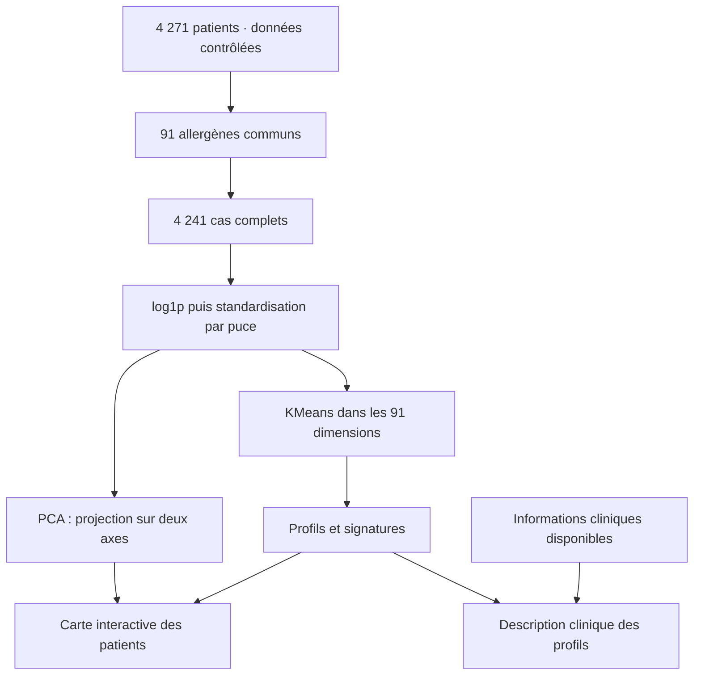

# Allergy Atlas — comprendre les choix du projet

*Support de présentation du projet M2 IA/Data · Allergen Chip Challenge*

> **Comment les profils de sensibilisation IgE se structurent-ils dans ACC, et quels liens présentent-ils avec les manifestations cliniques disponibles ?**

Cette question guide l’ensemble du dashboard : comprendre la population et ses mesures, explorer les signatures biologiques, puis les rapprocher des informations cliniques. Ce document explique les choix qui permettent de passer du fichier fourni à une exploration interprétable.

Les chiffres ci-dessous ont été recalculés sur le fichier source complet. Les résultats du modèle correspondent à la configuration par défaut : **standardisation par technologie et K = 2**. Dans l’application, les graphiques de population et leurs textes « À retenir » évoluent avec les filtres ; les diagnostics du modèle restent ceux de la cohorte source.

## Sommaire

1. [La question avant les graphiques](#question)
2. [Les données dont nous disposons](#donnees)
3. [Un vocabulaire commun pour présenter](#vocabulaire)
4. [Nettoyer sans inventer d’information](#nettoyage)
5. [Pourquoi retenir 91 allergènes ?](#comparabilite)
6. [Pourquoi une application Dash et Plotly ?](#technologies)
7. [Un parcours visuel qui répond à la question](#parcours)
8. [Comment les profils sont construits](#methode)
9. [Les résultats que l’on peut présenter](#resultats)
10. [Ce que l’interaction apporte à l’analyse](#interactions)
11. [Les limites et les prolongements possibles](#limites)
12. [Une conclusion et un exemple de prise de parole](#oral)

---

## 1. La question avant les graphiques

Un patient possède de nombreuses mesures IgE. Un classement d’allergènes ne suffit donc pas à décrire sa signature, et une moyenne globale masque la diversité des patients. La difficulté est de rendre cette complexité lisible, tout en tenant compte de trois technologies de mesure et d’informations cliniques incomplètes.

Le projet poursuit trois objectifs : **décrire** la diversité des signaux, **regrouper** des signatures proches et **explorer** les différences observées entre populations. Chaque chapitre apporte une pièce de cette réponse.

La question est affichée dès l’accueil et rappelée dans les chapitres. Sous les graphiques, les encadrés « À retenir » relient la représentation à un constat court ou à une clé de lecture. Le lecteur peut ainsi comprendre ce que le graphique apporte à l’argumentation.

## 2. Les données dont nous disposons

Le [CSV fourni](../data/raw/allergenchipchallenge-data-corrected-final-hdh-sfa.csv) contient **4 271 patients et 256 colonnes**, dont **241 mesures IgE**. Une ligne représente un patient identifié de manière pseudonymisée. Les autres colonnes décrivent notamment son âge, sa technologie de mesure, la sensibilisation fournie par la source et certaines informations cliniques.

| Technologie | Patients | Mesures IgE couvertes dans le fichier |
|---|---:|---:|
| ISAC V1 | 2 351 | 112 |
| ISAC V2 | 781 | 112 |
| ALEX | 1 139 | 223 |

Le [dictionnaire français](../data/dictionaries/acc-dictionnaire-final.xls) permet de lire les codes. Le [dictionnaire anglais](../data/dictionaries/dictionnaire-acc-english.pdf) apporte une documentation générale. Les [consignes du module](brief/Projets.pdf) cadrent le travail de conception, d’interaction et de présentation critique.

Le périmètre analysé reste celui du CSV réellement ouvert : une variable mentionnée dans un dictionnaire n’est pas nécessairement présente dans les données. C’est notamment le cas de **`Severe_Allergy`, absente du fichier**.

## 3. Un vocabulaire commun pour présenter

La vue **Repères & vocabulaire** rassemble 26 définitions courtes et une recherche. Elle est accessible pendant tout le parcours afin qu’un terme technique ne rompe pas le fil de la présentation.

| Terme | Sens dans ce projet |
|---|---|
| Détection IgE | Une mesure valide strictement supérieure à zéro. C’est la règle descriptive du dashboard. |
| Sensibilisation · source | La variable `Sensitization` fournie dans le fichier, conservée indépendamment du compte de détections. |
| Allergie clinique | Une notion qui nécessite un contexte clinique ; une mesure IgE seule ne permet pas d’établir ce diagnostic. |
| Profil / cluster | Un groupe statistique de signatures proches, sans signification automatique de gravité. |
| Points de pourcentage | La différence absolue entre deux fréquences. De 20 % à 30 % : +10 points. Cet exemple est fictif. |

Cette distinction entre mesure, variable source et interprétation clinique évite de faire porter aux graphiques une conclusion qu’ils ne démontrent pas.

## 4. Nettoyer sans inventer d’information

Le chargement vérifie les colonnes nécessaires, l’unicité des identifiants, les technologies et le format numérique. Le CSV utilise le point-virgule comme séparateur et la virgule pour les décimales.

Trois décisions structurent la préparation :

- **Conserver les originaux.** Les transformations produisent des données d’analyse ; les fichiers sources restent inchangés.
- **Distinguer les absences.** Une mesure non couverte par une puce, une valeur invalide et une information clinique non renseignée ne décrivent pas la même situation.
- **Calculer sur les observations disponibles.** Les fréquences IgE utilisent les mesures valides ; les fréquences cliniques utilisent les statuts renseignés.

Le fichier contient **52 valeurs IgE égales à −1 chez 36 patients**, sans signification documentée dans les dictionnaires consultés. Elles sont masquées pour l’analyse. Les remplacer par zéro aurait créé de fausses non-détections.

Pour les traitements, `0` signifie aucun traitement, `9` une information inconnue et les autres codes documentés un traitement déclaré. Pour les symptômes cutanés, `9` correspond à « sans objet / non pertinent » et reste non exploitable dans les comparaisons Oui/Non. Aucun de ces codages n’est converti en score de sévérité.

## 5. Pourquoi retenir 91 allergènes ?

ALEX couvre davantage de mesures que les puces ISAC. Comparer directement le nombre total de détections pourrait donc confondre une différence biologique avec une différence de couverture.

Le projet retient les **91 allergènes présents sur les trois plateformes** pour les comparaisons transversales et les profils. Chaque patient est alors comparé sur le même ensemble de cibles.

> **Un périmètre commun rend la comparaison mieux définie ; il ne rend pas les instruments identiques.**

Les unités, calibrations et performances analytiques peuvent différer. Les fréquences de détection restent descriptives et les comparaisons d’intensité brute demandent une lecture par technologie. La couverture est donc montrée avant les résultats biologiques.

**4 241 patients** possèdent toutes les mesures valides de ce panel. Les **30 autres** restent dans l’application, mais ne participent pas à la PCA ni au clustering. Leur nombre total de détections sur le panel commun est laissé indéfini, puisqu’une partie des mesures manque.

## 6. Pourquoi une application Dash et Plotly ?

Le besoin principal est de conserver une population cohérente entre plusieurs vues et de comparer des sélections construites pendant l’exploration. Une application Python permet de partager les mêmes règles de calcul entre indicateurs, graphiques et modèles.

| Technologie | Rôle concret |
|---|---|
| Python, pandas et NumPy | Lire, contrôler, transformer et agréger les données. |
| Dash | Relier les contrôles, la navigation et les sélections aux vues grâce aux callbacks. |
| Plotly | Afficher des figures avec survol, zoom, sélection et export. |
| scikit-learn | Standardiser les mesures, calculer KMeans, la PCA et la silhouette. |
| SciPy | Calculer le diagnostic d’association entre technologie et profil. |
| CSS et JavaScript | Adapter la mise en page et accompagner les changements de chapitre par des transitions. |
| pytest | Vérifier les calculs, les cas limites et les principaux comportements de l’application. |

Les modèles sont calculés et mis en cache pour une version des données et un mode de standardisation. Les filtres modifient ensuite les vues sans réapprendre les groupes à chaque clic. Cette séparation rend l’exploration plus fluide et les profils plus stables à interpréter.

Le [README](../README.md) détaille l’installation, l’organisation des fichiers et les responsabilités des modules.

## 7. Un parcours visuel qui répond à la question

Le dashboard suit un ordre de lecture, tout en laissant la navigation libre. Les titres posent les questions ; les graphiques apportent les éléments de réponse.

| Vue | Choix des représentations et intérêt |
|---|---|
| **Repères** | Définitions recherchables : partager les notions avant de commenter les résultats. |
| **Vue d’ensemble** | Histogramme des détections : montrer la distribution plutôt qu’une seule moyenne. Barres par puce : situer les effectifs. |
| **Les mesures** | Matrice de couverture : rendre visibles les différences structurelles. Barres de données non renseignées : montrer quelles comparaisons cliniques sont fragiles. |
| **Sensibilisation** | Barres classées : identifier les allergènes dominants. Courbe par classe d’âge : comparer des groupes d’âge observés. Heatmap individuelle : voir les combinaisons de signaux. Histogramme : retrouver la dispersion dans la sélection. |
| **Signaux cliniques** | Barres divergentes : lire le sens et l’amplitude des écarts Oui − Non. Barres empilées : garder les inconnus visibles. Diagramme de flux : montrer les combinaisons de caractéristiques. |
| **Les profils** | Nuage PCA : situer les patients sur un plan. Heatmap des empreintes : comparer les moyennes standardisées. Barres de surreprésentation : repérer les détections qui distinguent un profil. Composition par puce : interroger l’effet technologique. |
| **Mes cohortes** | Tableau A/B : comparer les indicateurs avec leurs effectifs. Barres divergentes B − A : localiser les différences de signatures. |
| **Conclusions** | Constats chiffrés et limites : répondre à la problématique avec une portée explicite. |

Deux précisions protègent la lecture : la courbe par âge compare des patients différents et ne décrit pas leur évolution individuelle ; le diagramme de flux montre des cooccurrences, pas une succession d’événements.

La heatmap individuelle affiche au plus **120 patients**, échantillonnés de manière déterministe et stratifiée par technologie. Elle illustre des motifs lisibles ; elle ne remplace pas les statistiques calculées sur toute la sélection.

## 8. Comment les profils sont construits

Les profils sont **non supervisés** : seules les mesures IgE servent à former les groupes. Les informations cliniques sont consultées ensuite pour les décrire.

**Transformer.** `log1p(x) = log(1 + x)` réduit le poids des très grandes valeurs et conserve les zéros. La règle de détection reste `x > 0`.

**Standardiser.** Chaque allergène transformé est centré et réduit séparément dans chaque technologie, par défaut. Cela réduit les écarts de moyenne et de dispersion entre puces, mais peut aussi atténuer de vraies différences de population. Une option globale permet d’examiner la sensibilité à ce choix ; aucune des deux n’est une calibration clinique.

**Regrouper.** KMeans utilise les **91 dimensions**, avec `K = 2…8`, dix initialisations et une graine fixée à 42. Le K proposé maximise la silhouette évaluée sur le même échantillon aléatoire de **1 500 patients** pour tous les K. Les tailles de groupes complètent cette lecture.

**Projeter.** La PCA produit une carte à deux axes à partir des mêmes mesures préparées. Elle facilite la lecture et la sélection, mais **KMeans n’est pas calculé sur ces deux axes**. Deux points proches à l’écran peuvent différer dans les dimensions non représentées.

Les numéros des groupes suivent leur nombre moyen croissant de détections communes. Ils servent à organiser l’affichage et ne constituent pas une échelle de gravité.

## 9. Les résultats que l’on peut présenter

| Résultat de référence | Lecture autorisée |
|---|---|
| Âge médian : **16 ans**, parmi **4 210** âges connus | La population est jeune ; ce chiffre décrit le fichier étudié. |
| Sensibilisation source : **3 579 / 4 271**, soit **83,8 %** | L’indicateur fourni est fréquent dans cette cohorte ; il ne représente pas la population générale. |
| Panel commun : médiane de **11 détections**, Q1–Q3 **4–21**, parmi **4 241** cas complets | Le nombre de signaux varie fortement entre patients. |
| **Phl p 1 : environ 50,0 %** de détection | Cet allergène est le plus fréquemment détecté sur le panel commun dans la cohorte complète. |
| Symptômes cutanés : **1 140 Oui**, **686 Non**, **2 445 non renseignés / non pertinents** | La comparaison clinique porte sur **1 826** patients, pas sur les 4 271. |
| **Ara h 2 : 27,7 % contre 8,5 %**, soit **+19,3 points** | La détection est plus fréquente chez les patients avec symptômes cutanés renseignés que chez ceux sans symptômes. L’écart est descriptif, sans ajustement. |
| Solution par défaut : **2 groupes de 3 433 et 808 patients**, silhouette **0,440** | Cette partition est celle retenue par le critère utilisé parmi les K testés ; sa validité clinique reste à établir. |
| PCA : **15,28 % + 7,26 % = 22,54 %** de variance expliquée | Les deux axes représentent une partie limitée de la variabilité. |
| Association puce × profil : **V de Cramér = 0,010** | Faible association globale dans cette solution, sans preuve d’absence de tout effet technologique. |

L’exemple Ara h 2 emploie **1 140 mesures observées dans le groupe Oui et 686 dans le groupe Non**. Les arrondis sont faits après calcul : la différence présentée vient des fréquences non arrondies.

Ces résultats montrent une diversité biologique et des différences cliniques observées. Ils ne suffisent pas à affirmer que les groupes statistiques correspondent à des formes médicales distinctes.

## 10. Ce que l’interaction apporte à l’analyse

Une sélection de patients se propage aux indicateurs et aux graphiques concernés. Le lecteur peut vérifier si un constat persiste dans une technologie, une tranche d’âge ou une sous-population. L’effectif et les filtres actifs restent visibles pour conserver le contexte.

Un clic sur un allergène retient les patients chez qui il est détecté. La sélection au lasso dans la PCA retient les identifiants exacts des patients dessinés. Les cohortes **A et B** mémorisent des instantanés : modifier ensuite les filtres ne modifie pas les patients déjà enregistrés.

**Exemple de démonstration :** exclure les âges inconnus, enregistrer les 0–17 ans en A, puis les 18–102 ans en B. Comparer les effectifs, les médianes et les fréquences sans annoncer d’écart avant de l’avoir lu. L’application indique aussi le chevauchement lorsque deux cohortes ne sont pas disjointes.

Les transitions accompagnent le passage entre les chapitres et respectent la préférence de réduction des animations. Elles soutiennent l’orientation dans le récit ; la lecture des données ne dépend pas d’elles.

## 11. Les limites et les prolongements possibles

La principale contrainte est la disponibilité de la clinique : **57,2 %** des statuts cutanés, **64,9 %** des informations de traitement de l’asthme et **69,3 %** de celles de la rhinite sont non exploitables. Les patients renseignés peuvent différer des autres ; un dénominateur correct ne supprime pas ce biais de sélection.

Les écarts ne sont pas ajustés pour l’âge, le sexe, la puce ou le recrutement. Les intervalles statistiques affichés sont exploratoires et sans correction de multiplicité. La proximité d’une moyenne ou la séparation visuelle de groupes n’établit donc ni causalité ni valeur prédictive.

Les regroupements dépendent du prétraitement et de K. Le panel commun limite les différences de couverture, mais ne règle pas toute la comparabilité analytique. Enfin, l’absence de `Severe_Allergy` empêche toute conclusion directe sur une cible de sévérité.

Des prolongements cohérents seraient de documenter les mécanismes de données manquantes, étudier la stabilité des groupes sous d’autres prétraitements, ajuster certaines associations pour des facteurs de confusion et confronter les profils à une cohorte indépendante avec une expertise clinique. **Ces étapes sont des perspectives, pas des résultats déjà obtenus.**

## 12. Une conclusion et un exemple de prise de parole

La réponse à la problématique est progressive : les mesures révèlent des signatures hétérogènes, un regroupement exploratoire permet de les organiser, et la clinique disponible permet d’examiner certaines différences. La portée de ces rapprochements reste limitée par les informations manquantes, les technologies et l’absence de validation clinique.

Le principal apport du projet est une exploration reproductible dans laquelle le lecteur peut retrouver **la population utilisée, le mode de calcul et la limite d’interprétation**.

**Exemple oral, en une minute :**

> « Notre question est de comprendre comment les profils IgE se structurent et quels liens ils présentent avec la clinique disponible. Nous partons de 4 271 patients mesurés avec trois technologies. Avant de comparer leurs signatures, nous retenons les 91 allergènes communs et nous distinguons une donnée absente d’une vraie valeur nulle.
>
> Le dashboard commence par rendre ces choix visibles, puis montre la diversité des signaux et les différences cliniques observées. Pour construire les profils, nous utilisons uniquement les IgE : transformation logarithmique, standardisation par puce et KMeans dans les 91 dimensions. La PCA sert ensuite à les représenter sur un plan.
>
> La solution par défaut propose deux groupes. Ce sont des profils exploratoires, dont la portée clinique reste à valider. L’interaction permet de comparer des populations et de vérifier les constats, tout en gardant les dénominateurs et les limites visibles. »

Pour préparer une démonstration complète : [guide de l’oral de dix minutes](oral-guide.md). Pour approfondir les choix visuels et méthodologiques : [contrat de conception](design-contract.md). Pour lancer l’application : [README](../README.md).
