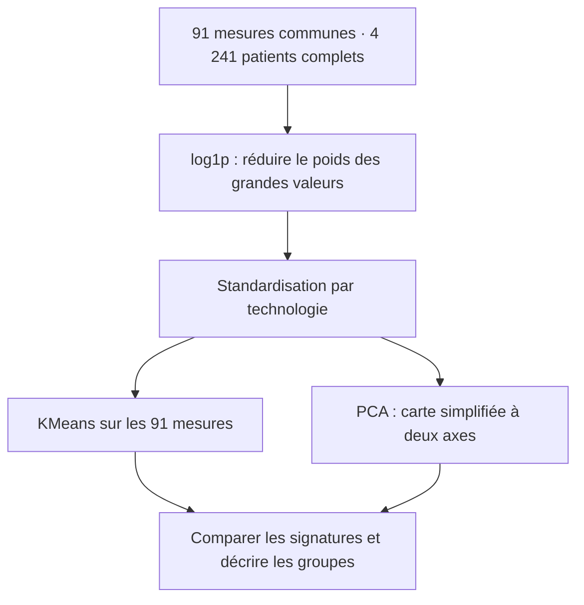

# Allergy Atlas — le raisonnement derrière le dashboard

*Projet M2 IA/Data · Allergen Chip Challenge · Support explicatif pour une présentation de dix minutes*

> **Comment rendre les profils IgE d’une cohorte lisibles, comparer les patients et explorer leurs liens avec la clinique disponible ?**

Allergy Atlas s’adresse d’abord à un **allergologue ou chercheur en allergologie** qui veut comprendre une cohorte, comparer des sous-populations et repérer des signaux à approfondir. Il ne propose ni diagnostic individuel ni prédiction de sévérité.

Le message central est simple : **les profils IgE diffèrent fortement d’un patient à l’autre. Organiser les mesures permet de rendre ces différences visibles et d’explorer certains liens cliniques, sans leur donner une portée que les données ne démontrent pas.**

La valeur du projet repose sur le parcours de datavisualisation. Le clustering intervient lorsque regarder les allergènes séparément ne suffit plus ; il reste un outil exploratoire au service de cette question.

## Deux façons de lire le même projet

**Story**, le mode proposé par défaut, présente la cohorte complète et le modèle de référence : standardisation par technologie et nombre de groupes retenu par la silhouette, soit **K = 2 sur le fichier fourni**. Le parcours reste reproductible pour l’oral. Les filtres, sélections graphiques et réglages conservés en Explore n’en modifient pas les résultats.

**Explore** rend disponibles les filtres, le filtrage croisé, le lasso PCA, les réglages du modèle et les cohortes A/B. Les textes « À retenir » suivent la population affichée. Revenir en Story conserve les réglages Explore et les cohortes enregistrées.

Le fil visuel comporte six étapes :

**Complexité → Comparabilité → Profils IgE → Clinique → Groupes → Conclusion**

Le **glossaire** reste accessible en appui. Le **laboratoire A/B** prolonge le récit après la conclusion ; il n’est pas une septième étape obligatoire. Les développements secondaires restent accessibles dans des sections repliables.

## 01 — Complexité : partir du problème

**Question.** Les patients présentent-ils des profils simples ou très différents ?

Le [fichier source](../data/raw/allergenchipchallenge-data-corrected-final-hdh-sfa.csv) contient **4 271 patients, 256 colonnes et 241 colonnes de mesures IgE**. Ces 241 mesures sont l’ensemble disponible dans le fichier, pas un nombre mesuré chez chaque patient. Trois technologies couvrent des ensembles d’allergènes différents.

La variable de sensibilisation fournie par la source concerne **3 579 patients sur 4 271, soit 83,8 %**. Elle reste distincte du nombre de détections calculé dans le dashboard.

**Pourquoi un histogramme ?** Une moyenne seule masquerait la dispersion. La distribution montre combien de patients présentent peu ou beaucoup de détections sur le même panel de 91 allergènes. Parmi les **4 241 profils complets**, la médiane est de **11**, avec un intervalle interquartile de **4 à 21**.

**Ce que cela apporte.** Une variable sensibilisé / non sensibilisé ne suffit pas à résumer cette diversité. Le nombre de signaux donne déjà une information supplémentaire, mais ne dit pas encore quels allergènes se combinent.

**La question suivante : peut-on réellement comparer tous les patients ?**

## 02 — Comparabilité : rendre les décisions visibles

**Obstacle.** Un compte sur toutes les mesures disponibles donnerait davantage d’occasions de détection aux patients mesurés avec ALEX.

| Technologie | Patients | Mesures couvertes |
|---|---:|---:|
| ISAC V1 | 2 351 | 112 |
| ISAC V2 | 781 | 112 |
| ALEX | 1 139 | 223 |

**Pourquoi une matrice de couverture ?** Elle montre directement ce qui est mesuré par chaque technologie. Une case sans mesure représente une absence de couverture, pas une non-détection chez un patient.

**Décision 1 : retenir le panel commun.** Les comparaisons transversales et les groupes utilisent les **91 allergènes présents sur les trois technologies**.

**241 mesures disponibles → 91 mesures communes → 4 241 patients complets**

Les 30 patients incomplets restent dans les autres analyses. Leur compte total sur le panel commun n’est pas défini et ils ne participent ni à KMeans ni à la PCA. Un panel commun limite les différences de couverture ; il ne rend pas les instruments parfaitement interchangeables.

**Décision 2 : conserver les inconnus comme inconnus.** Les fréquences IgE utilisent les mesures valides et les fréquences cliniques les statuts renseignés. Les barres de données manquantes rendent leurs dénominateurs et leurs limites visibles.

Les **52 valeurs IgE à −1 chez 36 patients** n’ont pas de signification documentée dans les dictionnaires consultés. Elles sont masquées pour l’analyse, jamais remplacées par zéro. Les fichiers originaux sont conservés. Pour la clinique, un code inconnu ou non pertinent ne devient pas une absence de symptôme.

**La question suivante : sur ce panel commun, comment les signaux se répartissent-ils et se combinent-ils ?**

## 03 — Profils IgE : du classement à la combinaison

**Question.** Les patients présentent-ils les mêmes signaux ?

La lecture avance en deux temps :

1. **Vue de la cohorte.** Les barres classées identifient les allergènes les plus souvent détectés. **Phl p 1 arrive en tête, avec environ 50,0 %** de détection sur le panel commun.
2. **Vue des patients.** La distribution rappelle la dispersion des comptes. La heatmap patient × allergène montre que les différences portent aussi sur les combinaisons de signaux.

**Pourquoi les deux vues ?** Une fréquence globale ne dit pas si deux allergènes sont détectés chez les mêmes patients. La heatmap rend cette coexistence visible. Elle montre au plus **120 patients**, sélectionnés de manière déterministe et stratifiée par technologie ; les statistiques générales portent sur toute la population affichée.

Dans ce projet, une détection correspond à une **mesure valide strictement supérieure à zéro**. Cette règle descriptive ne constitue pas un seuil diagnostique universel. La transformation `log1p` de la heatmap facilite la lecture des amplitudes sans changer la règle de détection.

La comparaison par âge reste un approfondissement : elle compare des patients différents, sans retracer leur évolution individuelle. Les intensités brutes demandent une lecture par technologie, car leurs unités et calibrations ne sont pas harmonisées.

**La question suivante : cette diversité biologique s’accompagne-t-elle de différences cliniques observées ?**

## 04 — Clinique : un exemple concret et une portée explicite

**Question.** Certaines détections diffèrent-elles selon les informations cliniques disponibles ?

`Severe_Allergy` est documentée dans le dictionnaire général, mais **absente du CSV fourni**. Le projet compare donc les symptômes cutanés et les traitements déclarés de l’asthme, de la rhinite et de la dermatite. Aucun traitement ni cumul d’IgE n’est transformé en score de sévérité.

Les symptômes cutanés, proposés par défaut, sont répartis ainsi : **1 140 Oui, 686 Non et 2 445 non renseignés ou non pertinents**. Le contraste Oui/Non porte sur 1 826 patients, pas sur toute la cohorte.

**Pourquoi des barres divergentes ?** Leur direction indique le groupe où la détection est la plus fréquente ; leur longueur exprime la différence en points de pourcentage.

| Exemple Ara h 2 | Fréquence de détection | Mesures valides |
|---|---:|---:|
| Avec symptômes cutanés | 27,7 % | 1 140 |
| Sans symptômes cutanés | 8,5 % | 686 |
| Écart Oui − Non | **+19,3 points** | Calculé avant arrondi |

**Ce que l’on peut dire.** Ara h 2 est plus souvent détecté chez les patients avec symptômes cutanés dans la population renseignée.

**Ce que l’on ne peut pas dire.** Cet écart ne démontre ni une cause ni une capacité à prédire une allergie sévère. L’âge, la technologie, le recrutement et les informations manquantes peuvent contribuer à l’écart. Un traitement déclaré ne décrit pas à lui seul la présence ou la gravité d’une maladie.

Les compositions cliniques et le diagramme de flux permettent d’approfondir. Les flux décrivent des cooccurrences, pas un parcours temporel.

**La question suivante : peut-on regarder les 91 mesures ensemble ?**

## 05 — Groupes : organiser des profils proches

**Question.** Des groupes de patients aux signatures proches apparaissent-ils lorsque toutes les mesures sont considérées ensemble ?

Les variables cliniques ne servent pas à construire les groupes. Elles sont consultées ensuite pour les décrire.

**Pourquoi cette préparation ?** `log1p(x) = log(1 + x)` réduit le poids des valeurs extrêmes en conservant les zéros. La standardisation centre et réduit chaque allergène dans chaque technologie. Elle réduit certains écarts de mesure, sans garantir une calibration commune, et peut atténuer de vraies différences de population. Le mode global permet d’examiner la sensibilité à ce choix en Explore.

**Pourquoi deux groupes ?** Les solutions K = 2 à 8 sont comparées sur le même échantillon fixe de 1 500 patients. Dans la configuration de référence, **K = 2 donne la meilleure silhouette : 0,440**. Ce critère décrit la séparation des groupes dans les données ; il ne valide pas deux catégories médicales. Les deux groupes rassemblent **3 433 et 808 patients**.

**Pourquoi plusieurs représentations ?** La PCA situe les patients sur une carte ; les empreintes montrent ce qui distingue leurs mesures ; la composition par technologie aide à vérifier si le regroupement reflète surtout les puces. Les allergènes caractéristiques et la composition clinique apportent des détails complémentaires.

**KMeans utilise les 91 mesures. La PCA sert à visualiser.** Ses deux axes représentent **22,54 % de la variance** : la carte reste partielle. Les numéros des groupes suivent leur nombre moyen de détections ; ils ne classent pas la gravité.

Le **V de Cramér puce × groupe vaut 0,010** dans cette solution. Le lien global avec la technologie est faible, sans prouver l’absence de tout effet de plateforme. Les groupes restent des **profils exploratoires**.

**La question suivante : qu’avons-nous réellement appris, et jusqu’où pouvons-nous conclure ?**

## 06 — Conclusion : séparer les constats des interprétations

| Niveau | Message |
|---|---|
| **Établi dans cette cohorte** | Les profils IgE sont différents ; la couverture impose un panel commun ; certaines fréquences diffèrent selon la clinique renseignée ; les 91 mesures permettent de construire des groupes proches. |
| **Suggéré par l’exploration** | Les profils apportent plus d’information qu’une variable binaire ; certains signaux et groupes méritent une étude clinique complémentaire. |
| **Non démontré** | Une prédiction de sévérité, une cause, un diagnostic par groupe ou une généralisation à toute la population. |

> **Allergy Atlas transforme des centaines de mesures IgE en profils plus lisibles pour explorer une cohorte, comparer des sous-populations et repérer des signaux à approfondir. Les résultats restent exploratoires.**

Les informations cliniques non exploitables représentent **57,2 %** pour les symptômes cutanés, **64,9 %** pour le traitement de l’asthme et **69,3 %** pour celui de la rhinite. Des dénominateurs corrects n’annulent pas le risque de différences entre patients renseignés et non renseignés.

Les écarts sont descriptifs, sans ajustement des facteurs de confusion. Les intervalles affichés sont exploratoires, sans correction de multiplicité. Une validation clinique, une étude de stabilité des groupes et une cohorte indépendante seraient des prolongements ; ce ne sont pas des résultats déjà obtenus.

## Après le récit — le laboratoire et le glossaire

Le laboratoire **« À vous d’explorer »** ouvre le mode Explore. Quatre exemples permettent de comparer rapidement **enfants / adultes, hommes / femmes, avec / sans symptômes cutanés, groupes 1 / 2**.

Chaque exemple **remplace A et B à partir de la cohorte source entière**, indépendamment des filtres et de la sélection graphique. Le contraste d’âge exclut les âges inconnus ; le contraste cutané exclut les statuts inconnus. Le contraste groupes 1 / 2 utilise le modèle courant en Explore : si K dépasse 2, il compare seulement ces deux groupes.

Pour créer ses propres cohortes, l’utilisateur filtre ou sélectionne des patients puis enregistre A et B. Ces instantanés conservent leurs identifiants même si les filtres changent ensuite. Les cohortes sont stockées localement dans le navigateur et leur chevauchement éventuel est indiqué. Dans le graphique A/B, le contraste est **B − A** ; dans le graphique clinique, il est **Oui − Non**.

Le glossaire explique surtout les notions statistiques utiles à la lecture : PCA, clustering, silhouette, quartiles ou points de pourcentage. Il accompagne le parcours sans imposer une étape supplémentaire pendant l’oral.

## Pourquoi ces technologies ?

| Technologie | Rôle concret |
|---|---|
| Python, pandas, NumPy | Contrôler les sources, préparer les données et partager les mêmes règles de calcul. |
| Dash | Relier les modes de lecture, les contrôles, les sélections et les vues. |
| Plotly | Proposer survol, zoom, sélection graphique et export des figures. |
| scikit-learn | Préparer les mesures, calculer KMeans, PCA et silhouette. |
| SciPy | Calculer l’association entre technologie et groupe. |
| CSS et JavaScript | Hiérarchiser l’information, adapter l’affichage et animer les transitions. |
| pytest | Vérifier calculs, dénominateurs, cas limites et comportements de l’application. |

Les modèles sont calculés sur la cohorte source admissible et mis en cache. Les filtres changent ensuite l’affichage, sans réapprendre les groupes à chaque sélection. Le passage entre chapitres utilise des transitions légères, désactivées lorsque la préférence système demande une réduction des animations.

La refonte conserve les sources, les calculs et les interactions existantes. Elle renforce la question, la décision méthodologique, la lecture et la conclusion autour des mêmes analyses, avec moins de détails simultanés à l’écran.

**Pour poursuivre :** [guide oral de dix minutes](oral-guide.md) · [contrat de conception](design-contract.md) · [installation et architecture](../README.md) · [dictionnaire français](../data/dictionaries/acc-dictionnaire-final.xls) · [dictionnaire anglais](../data/dictionaries/dictionnaire-acc-english.pdf) · [consignes du module](brief/Projets.pdf).
